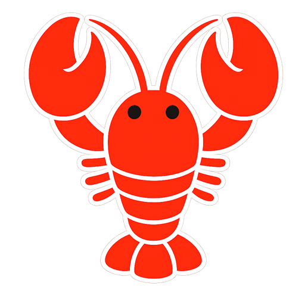

<p align="center">
  
</p>

<h1 align="center">ClawHub</h1>

<p align="center">
  <a href="https://github.com/openclaw/clawhub/actions/workflows/ci.yml?branch=main"></a>
  <a href="https://discord.gg/clawd"></a>
  <a href="LICENSE"></a>
</p>

<p align="center">
  <a href="README.md">English</a> ·
  <strong>中文</strong>
</p>

ClawHub 是 **Clawdbot 的公开技能注册中心**：你可以在这里发布、进行版本控制并搜索基于文本的 Agent 技能（包含一个 `SKILL.md` 及其支持文件）。
专为快速浏览和对 CLI 友好的 API 而设计，并配备了审核机制和向量搜索功能。

onlycrabs.ai 则是 **SOUL.md 注册中心**：你可以像发布技能一样在这里发布和分享系统的"灵魂"设定 (lore)。

<p align="center">
  <a href="https://clawhub.ai">ClawHub</a> ·
  <a href="https://onlycrabs.ai">onlycrabs.ai</a> ·
  <a href="VISION.md">愿景</a> ·
  <a href="docs/README.md">文档</a> ·
  <a href="CONTRIBUTING.md">参与贡献</a> ·
  <a href="https://discord.gg/clawd">Discord</a>
</p>

## 你能用它做什么

- 浏览技能并渲染查看它们的 `SKILL.md`。
- 发布带有更新日志和标签（包括 `latest` 最新标签）的新技能版本。
- 重命名你拥有的技能，而不会破坏旧链接或用户的安装。
- 将你名下的重复技能合并为一个规范的标识符 (slug)。
- 浏览系统灵魂 (souls) 并渲染它们的 `SOUL.md`。
- 发布带有更新日志和标签的新灵魂版本。
- 通过嵌入向量 (vector index) 进行语义搜索，而非死板的关键字搜索。
- 支持星标和评论；管理员/版主可以对技能进行策展和审批。

## onlycrabs.ai (SOUL.md 注册中心)

- 基于域名的入口：访问 `onlycrabs.ai`。
- 在 onlycrabs.ai 域名下，主页和导航默认显示 souls (灵魂)。
- 在 ClawHub 主站，souls 位于 `/souls` 路径下。
- Soul 包目前只接受 `SOUL.md` 文件（暂不支持附带其他文件）。

## 它是如何工作的（高级架构）

- Web 应用：基于 TanStack Start (React, Vite/Nitro)。
- 后端：使用 Convex (数据库 + 文件存储 + HTTP Actions) + Convex Auth (GitHub OAuth 认证)。
- 搜索：使用 OpenAI 的嵌入模型 (`text-embedding-3-small`) + Convex 向量搜索。
- API Schema 与路由：定义在 `packages/schema` (`clawhub-schema`) 中。

## CLI (命令行工具)

常用的 CLI 流程：

- 认证：`clawhub login`, `clawhub whoami`
- 探索：`clawhub search ...`, `clawhub explore`
- 管理本地安装：`clawhub install <slug>`, `clawhub uninstall <slug>`, `clawhub list`, `clawhub update --all`
- 免安装检查：`clawhub inspect <slug>`
- 发布与同步：`clawhub publish <path>`, `clawhub sync`
- 规范化自有技能：`clawhub skill rename <slug> <new-slug>`, `clawhub skill merge <source> <target>`

参考文档：[`docs/quickstart.md`](docs/quickstart.md), [`docs/cli.md`](docs/cli.md)。

### 移除与删除权限

- `clawhub uninstall <slug>` 仅仅从你本地的机器上移除该技能的安装。
- 已上传到注册中心的技能使用软删除/恢复机制 (`clawhub delete <slug>` / `clawhub undelete <slug>` 或通过 API 相应操作)。
- 软删除/恢复权限开放给：技能所有者、版主和管理员。
- 彻底删除 (Hard delete) 仅限管理员操作（用于管理工具 / 封禁流程）。
- 所有者执行重命名操作时，旧的 slug 将被保留并作为重定向别名。
- 所有者执行合并操作时，源列表将被隐藏，旧的 slug 会重定向到合并后的规范目标。

## 遥测 (Telemetry)

当你处于登录状态并运行 `clawhub sync` 时，ClawHub 会跟踪最基础的**安装遥测数据**（用于统计技能的安装次数）。
如果你想禁用它，请执行：

```bash
export CLAWHUB_DISABLE_TELEMETRY=1
```

详细信息：[`docs/telemetry.md`](docs/telemetry.md)。

## 代码库结构

- `src/` — TanStack Start 应用程序 (路由, 组件, 样式)。
- `convex/` — 数据库 Schema + 增删改查操作 (queries/mutations/actions) + HTTP API 路由。
- `packages/schema/` — CLI 和 Web 应用共享的 API 类型/路由定义。
- [`docs/`](docs/README.md) — 项目文档 (架构、CLI、认证、部署等)。
- [`docs/spec.md`](docs/spec.md) — 产品与实现规范 (非常好的入门读物)。

## 本地开发

前置要求：[Bun](https://bun.sh/)（Convex 通过 `bunx` 运行，无需全局安装）。

```bash
bun install
cp .env.local.example .env.local
# 编辑 .env.local — 查看 CONTRIBUTING.md 获取本地 Convex 所需的配置值

# 终端 A：启动本地 Convex 后端
bunx convex dev

# 终端 B：启动 Web 应用 (端口 3000)
bun run dev

# 填充示例数据
bunx convex run --no-push devSeed:seedNixSkills
```

关于完整的设置说明（环境变量、GitHub OAuth、JWT 密钥、数据库种子），请参阅 [CONTRIBUTING.md](CONTRIBUTING.md)。

## 环境变量

- `VITE_CONVEX_URL`: Convex 部署地址 (`https://<deployment>.convex.cloud`)。
- `VITE_CONVEX_SITE_URL`: Convex 网站地址 (`https://<deployment>.convex.site`)。
- `VITE_SOULHUB_SITE_URL`: onlycrabs.ai 网站地址 (`https://onlycrabs.ai`)。
- `VITE_SOULHUB_HOST`: onlycrabs.ai 域名匹配 (`onlycrabs.ai`)。
- `VITE_SITE_MODE`: 可选的 SSR 构建覆盖参数 (`skills` 或 `souls`)。
- `CONVEX_SITE_URL`: 与 `VITE_CONVEX_SITE_URL` 相同 (用于认证 + Cookies)。
- `SITE_URL`: 应用 URL (本地环境: `http://localhost:3000`)。
- `AUTH_GITHUB_ID` / `AUTH_GITHUB_SECRET`: GitHub OAuth 应用凭证。
- `JWT_PRIVATE_KEY` / `JWKS`: Convex Auth 密钥。
- `OPENAI_API_KEY`: 用于搜索和索引的向量嵌入密钥。

## Nix 插件 (nixmode 技能)

ClawHub 可以将 nix-clawdbot 插件的指针存储在 SKILL 的 Frontmatter 元数据中，这样注册中心就能知道需要安装哪个 Nix 包。Nix 插件不同于常规的技能包：它将技能包、CLI 二进制文件及其配置标志/环境要求打包在了一起。

在你的 `SKILL.md` 中添加以下内容：

```yaml
---
name: peekaboo
description: Capture and automate macOS UI with the Peekaboo CLI.
metadata: {"clawdbot":{"nix":{"plugin":"github:clawdbot/nix-steipete-tools?dir=tools/peekaboo","systems":["aarch64-darwin"]}}}
---
```

通过 nix-clawdbot 进行安装：

```nix
programs.clawdbot.plugins = [
  { source = "github:clawdbot/nix-steipete-tools?dir=tools/peekaboo"; }
];
```
