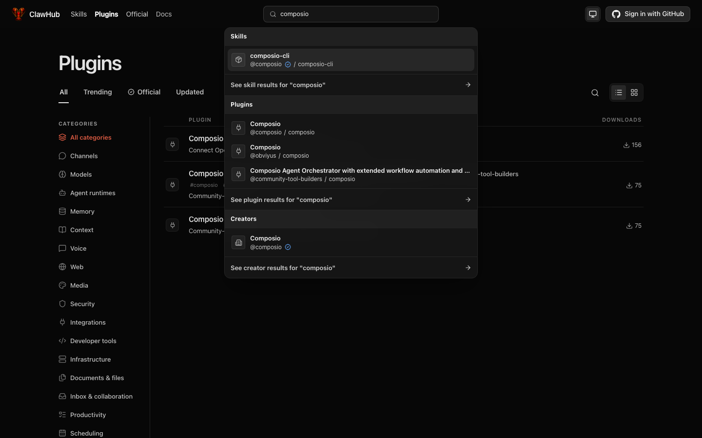
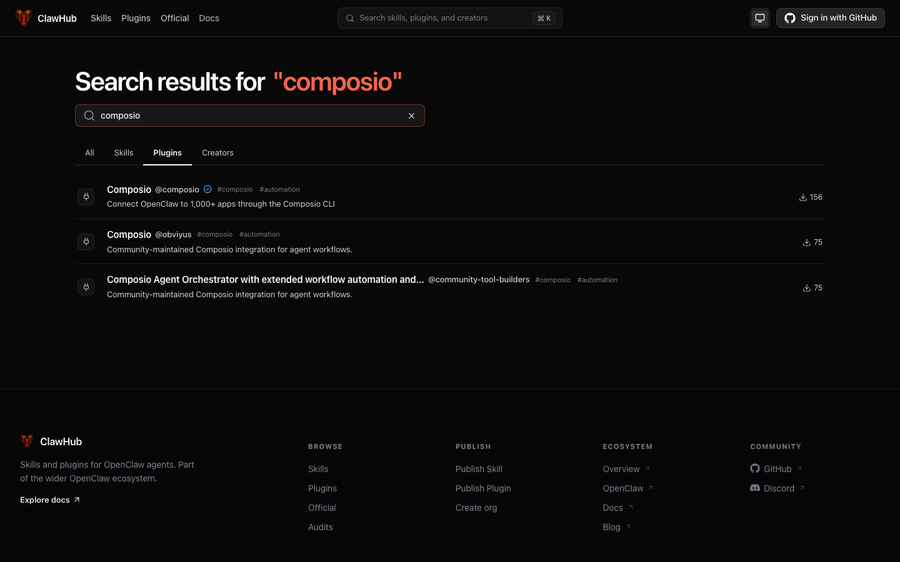
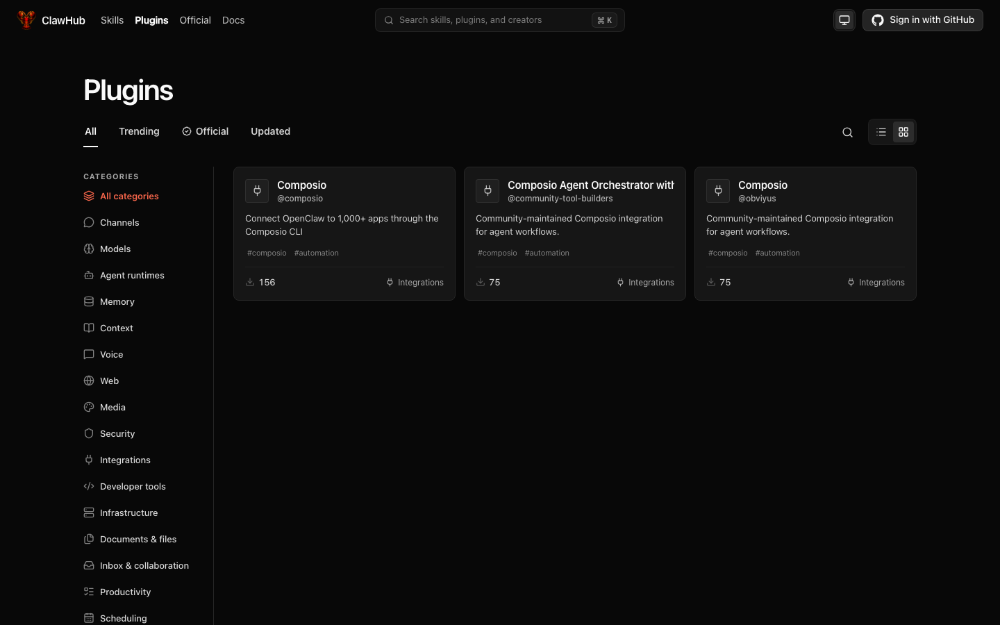
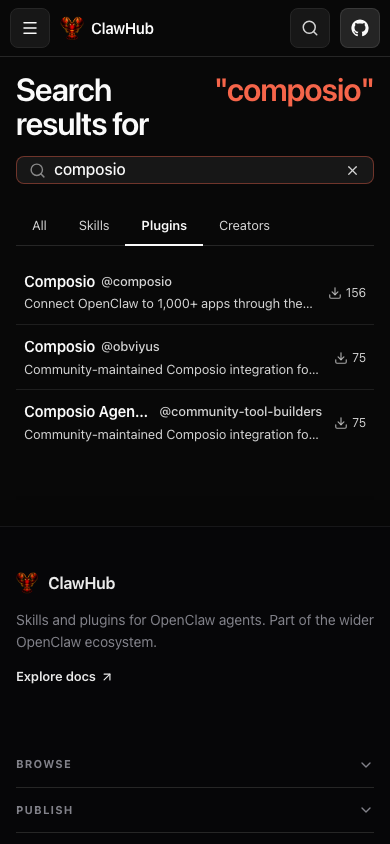
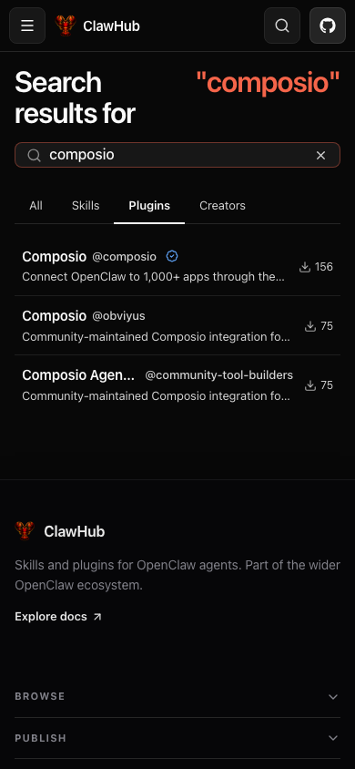
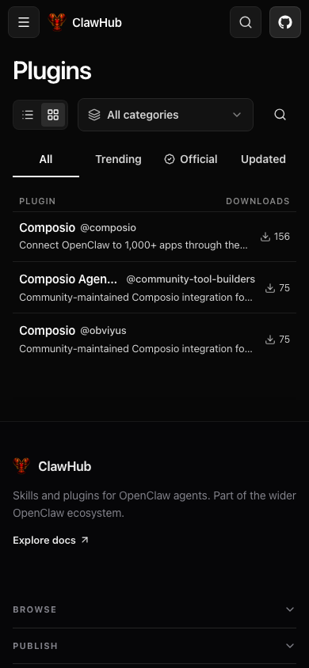
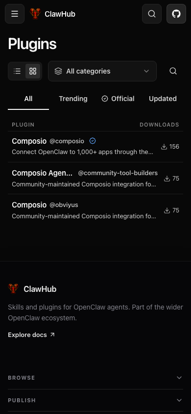

## Verified publisher badge parity

Baseline: `6b25e866fb`. Candidate: `9a63b68cdf07f4cbc1a620d555a6ed21530fd2bc`.

The plugin catalog previously exposed only package `isOfficial`/channel, so community-channel plugins from official publishers lost their blue check. The additive `ownerOfficial` field reads current publisher status, and dropdown/list/card rows reuse the existing OfficialBadge rule used by skills. Package endorsement, official-only filtering, and ranking are unchanged. Grant/revoke tests require no package digest backfill.

### Real-browser proof

Isolated, real ClawHub production builds with a disposable local Convex backend, not mocked HTML or API responses. Chromium, dark theme, signed out; frontend `http://127.0.0.1:3370`, backend HTTP `http://127.0.0.1:3372`. Same deterministic fixture in both lanes: official Composio organization; community `@composio/composio` package (`isOfficial=false`); two unverified publishers, including a long title/handle; Composio skill and creator rows.

Routes: `/plugins` + global search for composio, `/search?q=composio&type=plugins`, and `/plugins?view=grid`. Five paired captures cover desktop 1440×900 and mobile 390×844. Every screenshot was opened and visually inspected; runtime assertions also checked Composio's badge and unverified publisher absence.

| Surface / state | Viewport | Before | After |
| --- | --- | --- | --- |
| Search dropdown; typical + long title | 1440×900 |  |  |
| Plugin search list; typical + long title | 1440×900 |  |  |
| Plugin cards; typical + long title | 1440×900 |  |  |
| Plugin search list; typical + long title | 390×844 |  |  |
| Plugin browse; typical + long title | 390×844 |  |  |

### Verification

```text
node /tmp/claw-782-proof/run.mjs baseline
baseline: API and all requested browser cells passed
node /tmp/claw-782-proof/run.mjs candidate
candidate: API and all requested browser cells passed

bunx vitest run convex/packages.public.test.ts convex/packages.publisherBadges.runtime.test.ts src/__tests__/header.test.tsx src/components/PluginListItem.test.tsx src/lib/packageApi.test.ts
Test Files  5 passed (5)
Tests       410 passed (410)

bun run ci:static
exit 0

bun run ci:unit
Test Files  492 passed | 1 skipped (493)
Tests       6585 passed | 3 skipped (6588)
exit 0

bun run ci:types-build
production build completed (saved pre-restart log)

bunx tsc -p packages/schema/tsconfig.json --noEmit
bunx tsc -p packages/clawhub/tsconfig.json --noEmit
bunx tsc -p convex/tsconfig.json --noEmit
all exit 0 after recovery
```

Runtime regression coverage spans code/bundle plugins, search, updated/download-sorted browse and category filters; grants and revocations change ownerOfficial while isOfficial/channel remain unchanged. Four focused badge assertions failed on baseline and passed on candidate.

Review: TruffleHog passed; the autoreview Codex subprocess exited 1 without findings. Equivalent manual review completed per AGENTS.md: both projection paths, active/deleted publisher handling, optional schema compatibility, skill badge parity, unchanged filtering/ranking, and bounded indexed publisher lookups. No actionable findings. The companion behavior-validator skill was unavailable; real API/browser assertions above provide behavior proof.

Skipped matrix cells: loading/empty/error do not render these plugin rows and their branches are unchanged; badge state exists only after a result loads. Mobile uses native list layout rather than the desktop dropdown/card layout. No video: static badge visibility, not timing or motion, is the changed behavior. Existing layout/truncation behavior is retained.

Residual risk: publisher status adds indexed lookups to bounded catalog projections. No production database mutation or backfill is required. Autoland is explicitly authorized and remains the final step.
