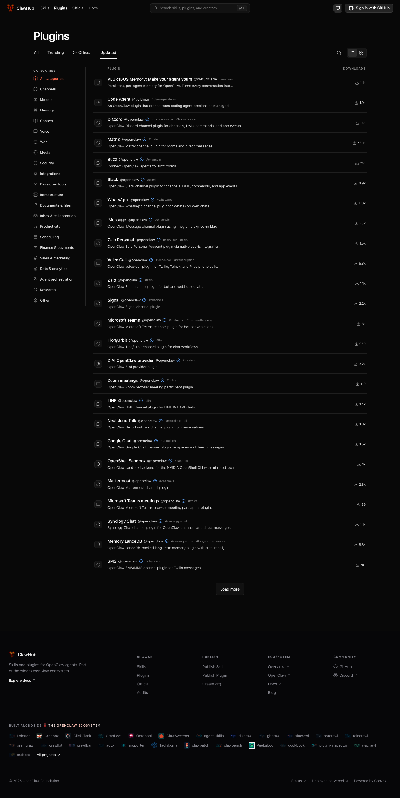
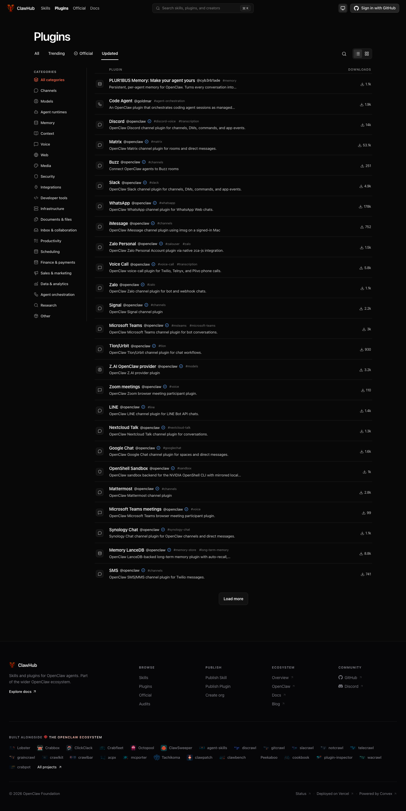
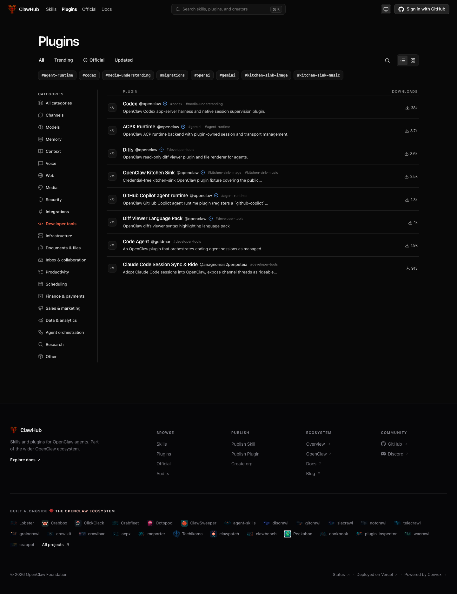
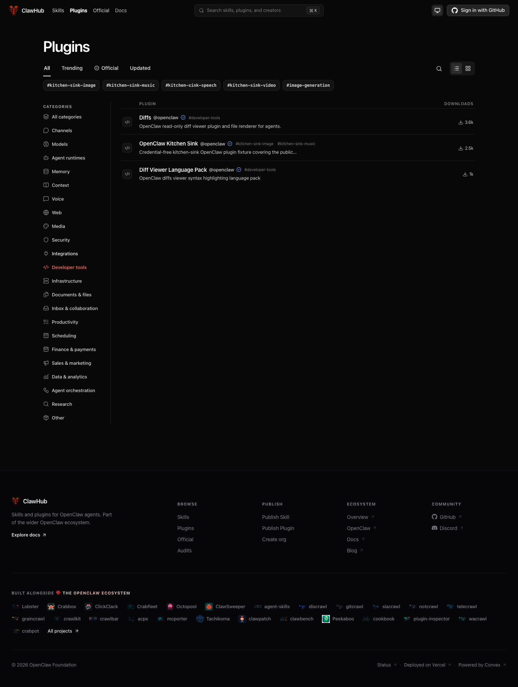
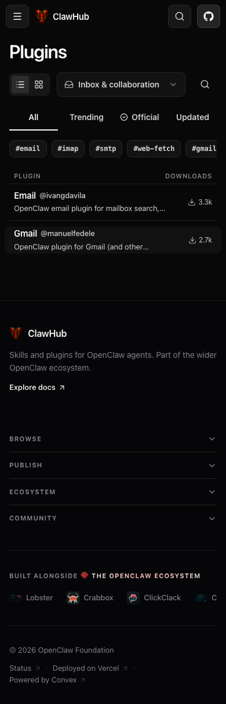
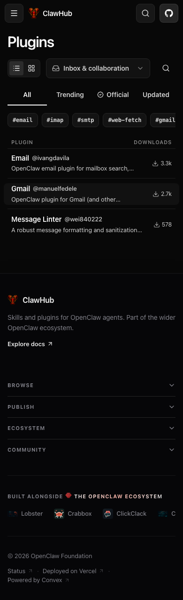
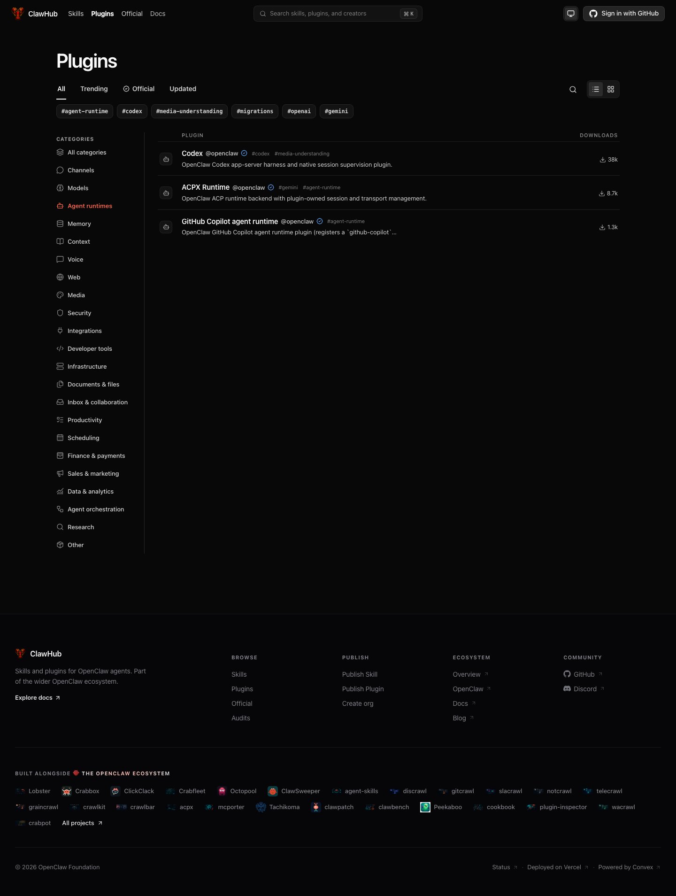
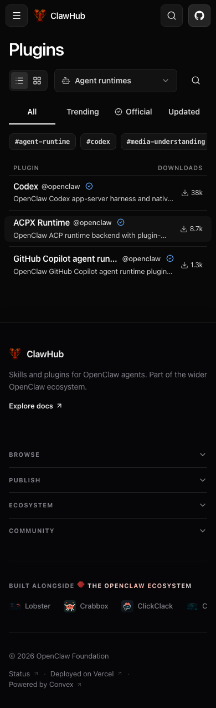

# ClawHub Agent runtimes proof

Real browser and local backend verification pass. The final local sample contains **93 applied assignments, six held proposals and one missing-evidence skip**. Production is unchanged.

## Scope and evidence

This local rehearsal uses **100 public production plugins, 190 releases, and 365 SHA-256-verified static manifest/documentation files (8.69 MB)** captured between 2026-09-09 02:48:41 and 02:51:29 UTC. It is a per-record logical snapshot, not a globally atomic database export. User profiles in the local fixture are synthetic. Public proof omits database IDs, storage IDs, local filesystem paths, credentials, and private hostnames. Production was read-only; plugin source artifacts were inspected as data and not executed by the classifier.

**59 real `gpt-5.6-luna` classifications succeeded.** Semantic review accepted 53 and held six proposals; **40 source-pinned bundled assignments complete 93 applied latest-release assignments**, of which **73 category values differ from original production metadata**. `gog-extended` has no readable bounded root-manifest evidence and is skipped. The six semantic holds are successful model responses that were not accepted; they are not model transport failures.

The real local Convex migration component processed batches of 10. Dry run and application passed, including **all 22 public category filters, all 100 package/search projections, and all 190 exact-version API responses**. All 90 historical releases and seven unselected latest releases stayed unchanged. Source files, hashes, storage references, scan state, and unrelated metadata stayed unchanged. Rollback restored all 100 package documents, all 190 release documents and their exact-version responses. Replaying the same 93 reviewed assignments required identical evidence hashes and current classifier/inventory identity, made **zero new model calls**, and passed reapplication plus a completed repeat with no changes. This is reviewed-assignment replay, not an independent model run.

## Category contract

The final vocabulary contains **22 categories**. Agent runtimes identifies execution engines that run the agent loop and own native sessions; its icon is Lucide `bot`. Context covers active-context assembly and compaction, Agent orchestration covers coordinating agents, and Developer tools covers software development workflows. This distinguishes runtime purpose from incidental coding or tool capabilities.

New releases declare exactly one category or receive one generated category from the shared publication/refresh classifier. The strict output schema permits one canonical slug; `OPENAI_PLUGIN_CATEGORY_MODEL` is a dedicated override. Explicit author declarations in already-published artifacts remain authoritative, including legacy multi-category declarations. Superseded generated previews cannot be accepted or applied. Failed generation falls back to Other for publication and cannot be accepted for backfill. Skills and historical releases are outside the refresh scope.

The source audit covers **152 bundled manifests, all single-category, and 149 named registry mappings** pinned to OpenClaw `3bf34b0570d3e55ad16f7c4cb25249797a59042b`. Relative to the preceding single-category source revision, only `acpx`, `codex`, and `copilot` move from Developer tools to Agent runtimes; non-category manifest fields remain unchanged. All 152 source rationales and evidence paths are retained in `summary.json`. `active-memory`, `device-pair`, and `talk-voice` have no source package name, so they are excluded from registry matching. Registry metadata updates do not alter archived package artifact bytes.

## Two distinct before states

The **UI baseline** is the preceding 21-category singleton implementation: ClawHub `c84bf8ed75` and OpenClaw `43d9cdff8f4`, with 97 reviewed v2 updates already applied to this same local sample. The UI candidate uses ClawHub `4db8c940aa` and OpenClaw `a06680b77c`, with 22 categories and the 93 reviewed v3 updates.

The **backend migration baseline** is independently restored original production metadata. Its 73 changed category values are measured against that original state; they are not the number of differences between the two UI screenshots. The old v2 assignments were fully rolled back before the fresh v3 model preview.

## Validation and limits

ClawHub: **6,517 unit tests pass (3 skipped)**, type/build and package gates pass, and the focused classifier/refresh/exact-version suite passes 16 cases. OpenClaw: **67 source/category tests and 253 runtime/discovery tests pass**, and runtime/UI builds pass. The tested ClawHub candidate predates the dependency fixes now on main; full static after restacking remains pending. The broader OpenClaw changed-file gate encounters the unchanged expired plugin-SDK compatibility deadline reproduced on baseline.

This 100-plugin rehearsal is not a complete production-catalog preview. Production application still requires a fresh preview under the final definitions, semantic review, dry run, and accepted bounded application. The sample contains no actual explicit category declarations in root manifests, so author precedence and new-publication behavior are demonstrated by publication and refresh tests, not by claiming those cases appeared in this sample.

## Reproduce the local operations

Seed a disposable local Convex backend with the bounded public records and verified static files. Rebuild category/search projections. Run `pluginCategoryRefresh:preview` with a fresh run ID and bounded batch size, continuing returned cursors. Inspect `pluginCategoryRefresh:list`, accept only reviewed IDs, dry-run `migrations:applyAcceptedPluginCategoryRefreshes`, then apply through `migrations:run`. Compare `POST /api/v1/packages/categories:batch` and every `GET /api/v1/plugins?category=...` result against stored metadata. Verify historical/unselected records and artifacts, exercise guarded rollback, and replay reviewed assignments only after revalidating identical evidence, classifier and source inventory. Verify a completed repeat is a no-op.

## Semantic review holds

| Package | Proposed | Retained | Review hold |
| --- | --- | --- | --- |
| hirey | integrations | other | People-matching workflow: the generic Integrations rationale ignores its primary purpose. |
| @vauxr/openclaw | channels | channels, tools, voice | Voice-device bridge remains ambiguous between Voice and Channels. |
| xhs-insights-openclaw-plugin | sales-marketing | other | Read-only social research matches Research like its Douyin sibling; evidence does not establish campaign operations. |
| imclaw | channels | channels, tools, media | Agent-to-agent social messaging conflicts with the human-agent Channels boundary. |
| web-search-plus-plugin-v2 | research | tools, web | Source-only generic search and extraction fits Web; the Research proposal is unsupported. |
| claude-code-sync | agent-runtimes | other | Session discovery, driver locks and relay: README identifies the gateway half and advisory spawn, without an agent execution engine to support Agent runtimes. |

## Real browser comparison

Captured in real Chromium on the agent host after waiting for the exact expected plugin identities, not only result counts. Desktop viewport: 1440×1080; mobile: 390×844. These are actual application screenshots; source pixels were not composed or edited.

Developer tools changes from **8 to 3** results. Three native runtimes move into Agent runtimes; Code Agent separately moves into Agent orchestration, and the held Claude Code Sync proposal retains original production metadata. The new Agent runtimes filter shows **Codex, ACPX and Copilot** with its Bot category icon. New-category desktop/mobile captures are **candidate-only**, since the v2 category list has no matching category.

ClawHub rendered at `http://127.0.0.1:4320/plugins`. Paired full-page captures show category navigation, Developer tools, and mobile Inbox & collaboration (2 → 3 results). Candidate-only captures show Agent runtimes at desktop and mobile widths.

Capture boundaries:

- Category navigation: Full-page screenshots of /plugins?sort=updated, showing 21 → 22 category navigation.
- Developer tools filter: Full-page screenshots of /plugins?category=developer-tools. Three native runtimes moved; Code Agent reclassified to orchestration; held Claude Code Sync retained original metadata.
- Mobile Inbox & collaboration: Same /plugins?category=inbox-collaboration filter. Full page.
- Agent runtimes filter (candidate only): New category; no prior equivalent screenshot.
- Mobile Agent runtimes filter (candidate only): 390 × 844 viewport; full-page capture.

| Paired state | Before | After |
| --- | --- | --- |
| Category navigation |  |  |
| Developer tools filter |  |  |
| Mobile Inbox & collaboration |  |  |

New-category captures (candidate only):

## Applied latest-release assignments

All 99 proposals and model/source explanations, including six holds, are retained in `summary.json`.

| Package | Version | Original production category | Applied category | Source |
| --- | --- | --- | --- | --- |
| @agentmessier/openclaw-agent-messier | 0.16.3 | other | other | generated |
| @alexbessarabenko/openclaw-max | 0.4.0 | channels, voice, models | channels | generated |
| @apify/apify-openclaw-plugin | 0.5.3 | tools, web | research | generated |
| @axonflow/openclaw | 2.9.0 | tools, security | security | generated |
| @byterover/byterover | 4.0.0 | context, tools | context | generated |
| @conan-scott/openclaw-fish-audio | 1.1.6 | voice, channels | voice | generated |
| @cyb3rb1ade/plur1bus-memory | 7.12.8 | other | memory | generated |
| @expediagroup/expedia-openclaw | 1.0.4 | tools, web, channels | other | generated |
| @gendigital/sage-openclaw | 0.12.0 | other | security | generated |
| @honcho-ai/openclaw-honcho | 1.5.5 | memory, tools, channels | memory | generated |
| @jason-vaughan/openclaw-google-oauth | 0.4.0 | tools | integrations | generated |
| @jeehou/openclaw-cursor-cli | 0.0.6 | models, runtime, security | models | generated |
| @manuelfedele/openclaw-gmail-plugin | 0.4.0 | tools, web | inbox-collaboration | generated |
| @mem0/openclaw-mem0 | 1.0.14 | memory, tools, models | memory | generated |
| @natebjones/ob1-agent-memory | 0.1.6 | memory, tools | memory | generated |
| @nowledge/openclaw-nowledge-mem | 0.8.31 | memory, context | memory | generated |
| @openclaw/acpx | 2026.9.3 | runtime, models | agent-runtimes | bundled |
| @openclaw/buzz | 2026.9.3 | other | channels | bundled |
| @openclaw/clickclack | 2026.9.3 | other | channels | bundled |
| @openclaw/codex | 2026.9.3 | models, media, gateway | agent-runtimes | bundled |
| @openclaw/copilot | 2026.9.3 | runtime | agent-runtimes | bundled |
| @openclaw/diagnostics-otel | 2026.9.3 | runtime | infrastructure | bundled |
| @openclaw/diagnostics-prometheus | 2026.9.3 | runtime | infrastructure | bundled |
| @openclaw/diffs | 2026.9.3 | channels, gateway, context | developer-tools | bundled |
| @openclaw/diffs-language-pack | 2026.9.3 | media, gateway | developer-tools | bundled |
| @openclaw/discord | 2026.9.3 | channels, media | channels | bundled |
| @openclaw/feishu | 2026.9.3 | channels | channels | bundled |
| @openclaw/google-meet | 2026.9.3 | tools, web, gateway | voice | bundled |
| @openclaw/googlechat | 2026.9.3 | channels | channels | bundled |
| @openclaw/imessage | 2026.9.3 | other | channels | bundled |
| @openclaw/kitchen-sink | 0.2.14 | context, memory, channels | developer-tools | generated |
| @openclaw/line | 2026.9.3 | channels | channels | bundled |
| @openclaw/lobster | 2026.9.3 | tools, security | agent-orchestration | bundled |
| @openclaw/matrix | 2026.9.3 | channels | channels | bundled |
| @openclaw/mattermost | 2026.9.3 | other | channels | bundled |
| @openclaw/memory-lancedb | 2026.9.3 | memory, tools | memory | bundled |
| @openclaw/msteams | 2026.9.3 | channels | channels | bundled |
| @openclaw/mxc-sandbox | 2026.9.3 | other | security | bundled |
| @openclaw/nextcloud-talk | 2026.9.3 | channels | channels | bundled |
| @openclaw/nostr | 2026.9.3 | channels | channels | bundled |
| @openclaw/openshell-sandbox | 2026.9.3 | security, runtime, gateway | security | bundled |
| @openclaw/sherpa-onnx-tts | 2026.6.8 | other | voice | generated |
| @openclaw/signal | 2026.9.3 | other | channels | bundled |
| @openclaw/slack | 2026.9.3 | channels | channels | bundled |
| @openclaw/sms | 2026.9.3 | other | channels | bundled |
| @openclaw/synology-chat | 2026.9.3 | channels | channels | bundled |
| @openclaw/team-reports | 2026.9.3 | other | data-analytics | bundled |
| @openclaw/teams-meetings | 2026.9.3 | other | voice | bundled |
| @openclaw/tlon | 2026.9.3 | channels | channels | bundled |
| @openclaw/tokenjuice | 2026.9.3 | runtime, context, gateway | context | bundled |
| @openclaw/venice-provider | 2026.9.3 | other | models | bundled |
| @openclaw/voice-call | 2026.9.3 | tools, voice | voice | bundled |
| @openclaw/volcengine-provider | 2026.9.3 | other | models | bundled |
| @openclaw/whatsapp | 2026.9.3 | channels | channels | bundled |
| @openclaw/zai-provider | 2026.9.3 | other | models | bundled |
| @openclaw/zalo | 2026.9.3 | channels | channels | bundled |
| @openclaw/zalouser | 2026.9.3 | channels, tools | channels | bundled |
| @openclaw/zoom-meetings | 2026.9.3 | other | voice | bundled |
| @openguardrails/moltguard | 6.9.4 | security | security | generated |
| @openviking/openclaw-plugin | 2026.9.8-2 | memory | context | generated |
| @qverisai/qveris | 2026.9.9 | models, context, web | integrations | generated |
| @robot-inventor/discord-ignore | 1.1.10 | other | channels | generated |
| @shellbot/openclaw-pixcli | 3.4.2 | tools, media, voice | media | generated |
| @soimy/dingtalk | 3.6.11 | channels | channels | generated |
| @tencentdb-agent-memory/memory-tencentdb | 0.2.2 | memory | memory | generated |
| @tensorfold/openclaw-google-workspace | 0.2.1 | tools | integrations | generated |
| @xmoxmo/bncr | 0.6.7 | other | channels | generated |
| 100-percent-skill-vetter | 2.0.1 | runtime, security, gateway | security | generated |
| apple-pim-cli | 3.18.0 | tools, security, web | productivity | generated |
| browser-use-plugin | 1.0.0 | web | web | generated |
| chrome-openclaw-sider | 1.0.26 | channels, runtime | channels | generated |
| clawlink-plugin | 0.3.6 | tools, channels, web | integrations | generated |
| database | 0.1.0 | (absent) | data-analytics | generated |
| douyin-insights-openclaw-plugin | 0.2.9 | other | research | generated |
| email | 0.1.0 | web | inbox-collaboration | generated |
| excel | 0.1.0 | tools | documents-files | generated |
| gc-provider | 0.1.33 | models, media | models | generated |
| google-ads-assistant | 1.0.0 | other | sales-marketing | generated |
| hivemind | 0.7.150 | other | memory | generated |
| holo-wechat-mp | 0.2.0 | media, channels | sales-marketing | generated |
| lobu | 14.0.0 | other | memory | generated |
| memsearch | 0.3.18 | memory, models | memory | generated |
| message-linter | 2026.7.1-beta.5 | other | inbox-collaboration | generated |
| octo | 1.4.1 | channels, tools | channels | generated |
| ocuclaw | 1.3.7 | other | channels | generated |
| openclaw-ai-video-editor | 1.1.2 | tools, media | media | generated |
| openclaw-browser-automation | 1.5.0 | web | web | generated |
| openclaw-code-agent | 4.7.15 | other | agent-orchestration | generated |
| openclaw-memory-graph | 0.19.6 | tools, models, memory | memory | generated |
| openclaw-plugin-heygen | 0.1.0 | media | media | generated |
| openclaw-seatalk | 1.1.1 | channels, tools, security | channels | generated |
| openclaw-weixin | 0.3.0 | other | channels | generated |
| sequential-thinking | 2026.7.1-2 | other | other | generated |

## Compatibility rollout follow-up

A separate native local Convex check at compatibility candidate `f6d0d1f0b1` verifies five malformed historical declarations remain manageable and a valid ordered Other/Models/Voice declaration agrees across exact-version HTTP and all three browse filters. All six regressions failed before the fix. An independent source-blind validator also exercised the built CLI: all eight warning/help/JSON/empty-value/topics/Claw dry-run clauses passed. CLI dry runs prove preparation and output, not backend publication. The combined compatibility layer passes 6,531 unit tests (3 skipped), full static, type/build and package gates. Scoped source reviews are clean. Detailed sanitized results are in `summary.json` under `compatibilityFollowup`; the earlier screenshots remain the recorded 22-category sample comparison.
