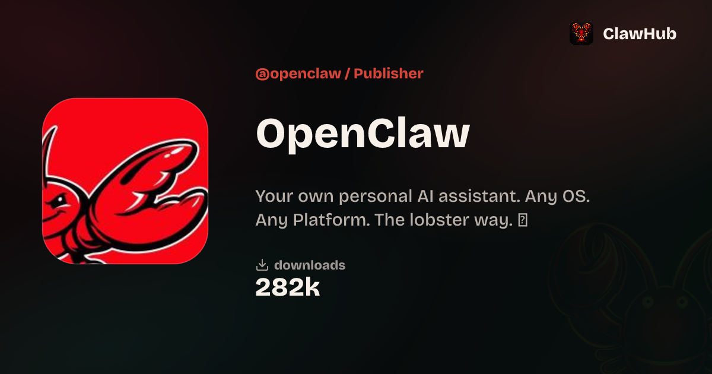
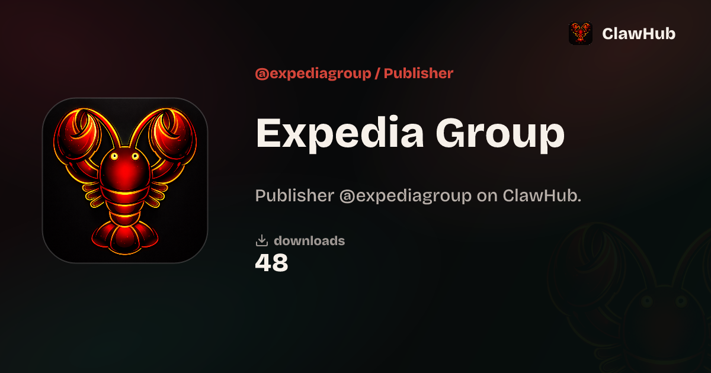

## Visual proof

Publisher OG images captured from local ClawHub at `http://localhost:3000/og/profile` against production Convex data.

Each card shows the org logo (or default lobster mark), compact downloads (e.g. `43.5k`), a download icon, and lowercase `downloads` — not Installs.

### @nvidia (org with custom profile image + compact downloads)

### @openclaw (org with GitHub avatar + compact downloads)

### @expediagroup (org without profile image — default mark + compact downloads)

