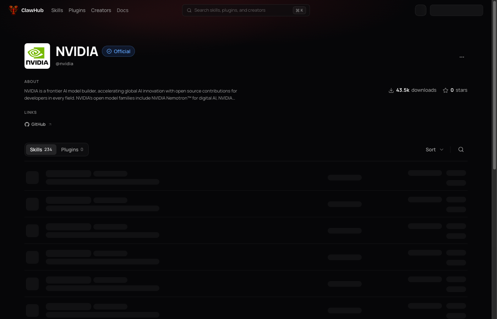
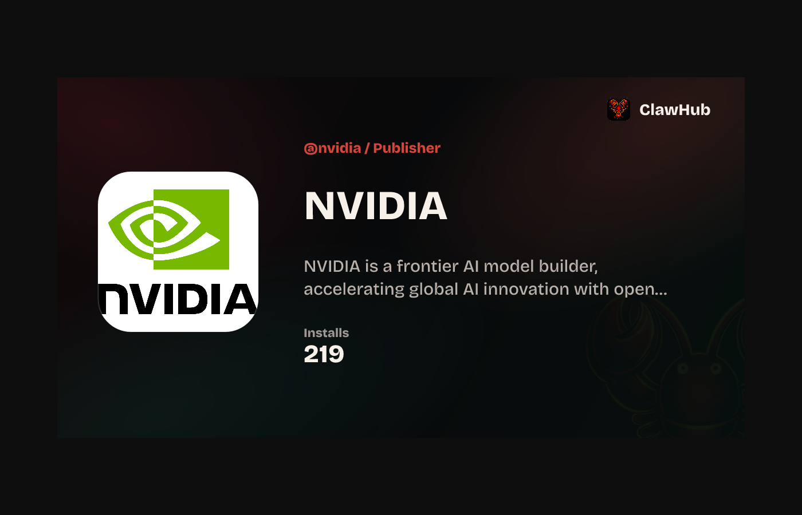
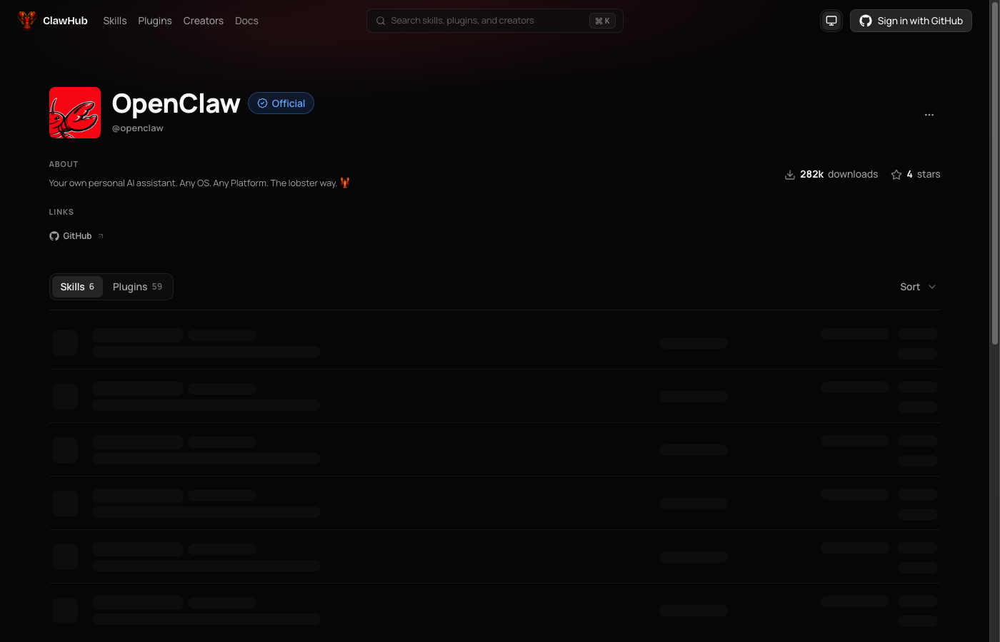
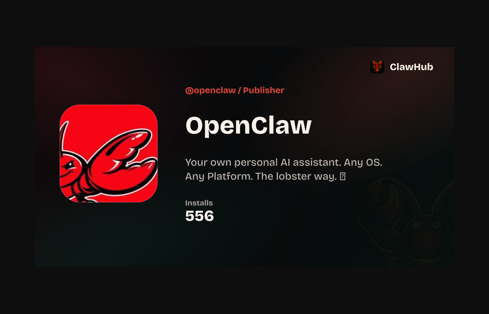
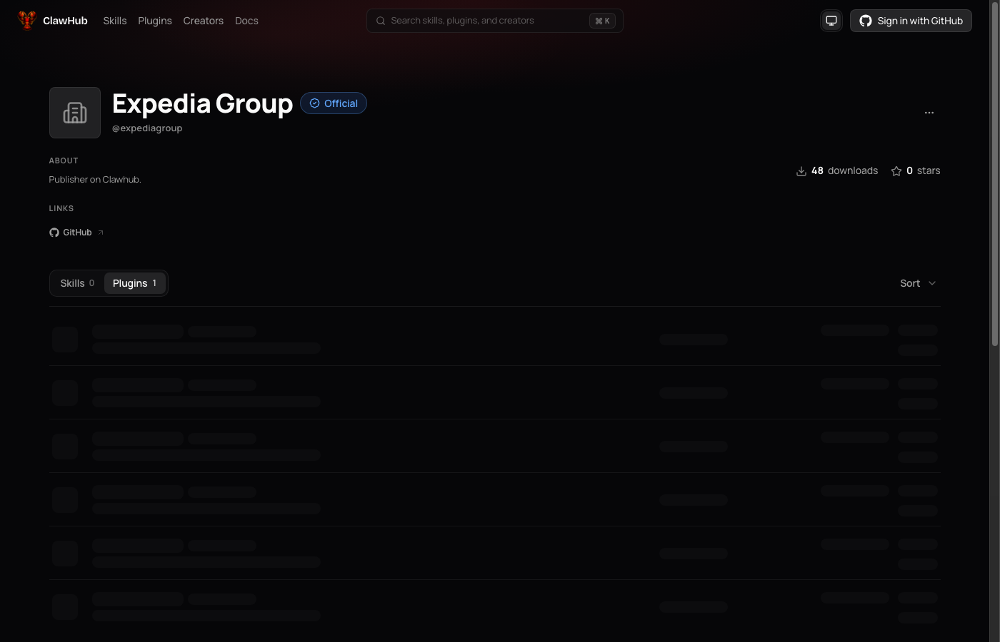
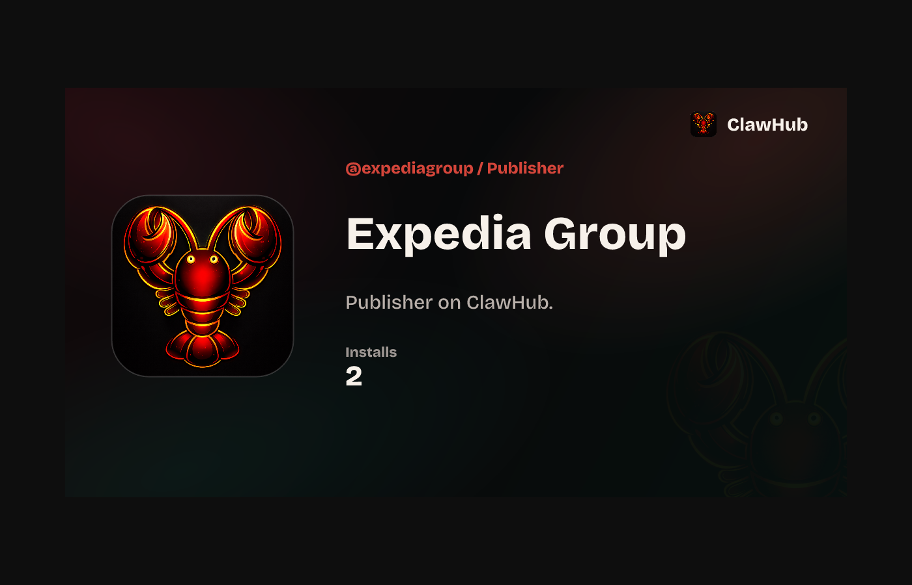

## Visual proof

Captured from local ClawHub (`http://localhost:3002`) with production Convex data via headless Chrome.

### @nvidia (org with custom profile image)

Profile page:

OG card (shows NVIDIA logo, not default lobster avatar):

### @openclaw (org with GitHub avatar)

Profile page:

OG card:

### @expediagroup (org without profile image — default mark expected)

Profile page:

OG card (falls back to default ClawHub mark):

